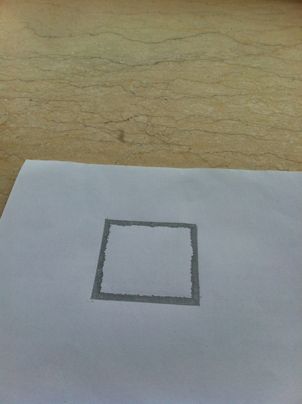
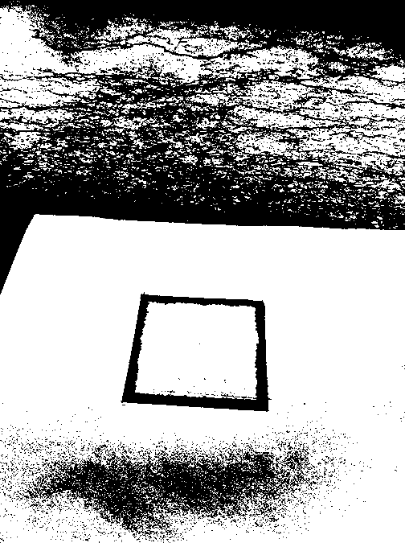
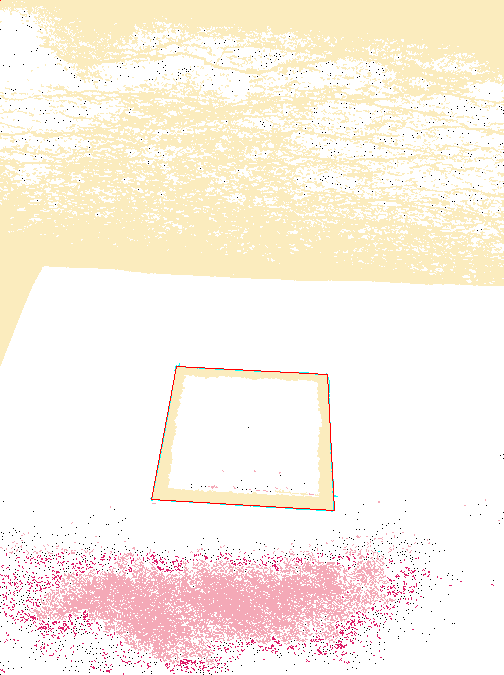
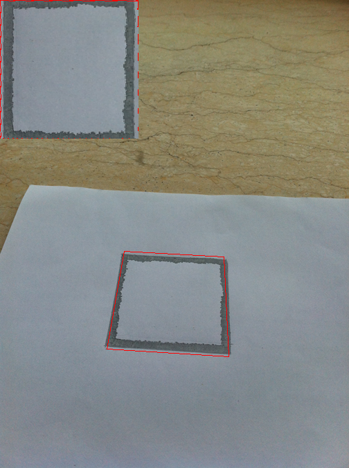
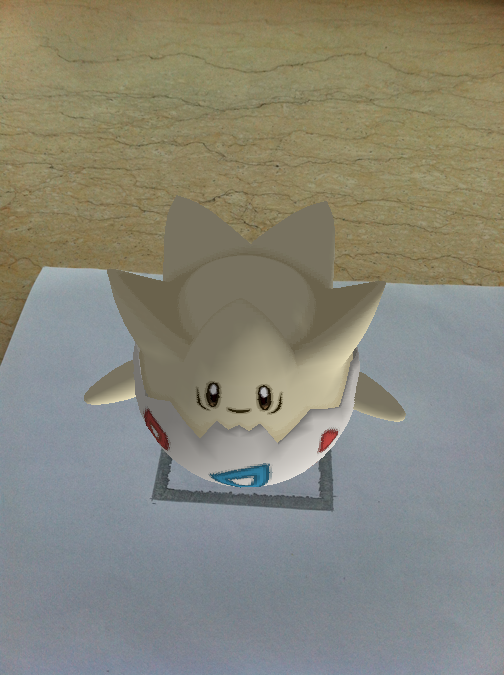

# Augmented Reality Algorithm 2017.2

A javascript demo that employs augmented reality algorithm coded by Legend Chen.

______________

1、Original image

2、Adjustment for gray scale

3、Estimating square's contour and Calculating the transform matrix in scene

4、Pattern matching and model‘s orientation 

5、The final reslut

